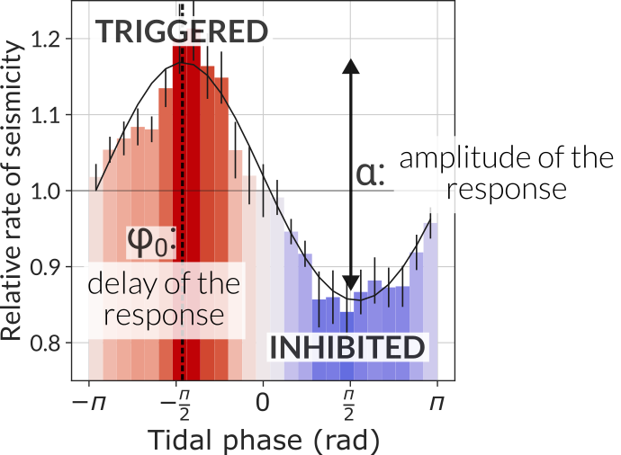

# seistides
Python package for the analysis of tidal modulation of seismicity.

Use `seistides` to measure and characterize the modulation of the rate of seismicity by the
tidal stresses following the methodology described in Beaucé et al. (2023, in review). Check
out examples in `seistides/notebooks`.

  

Former versions
---------------

Check out the Jupyter notebook in `seistides`'s initial version
[https://github.com/ebeauce/seistides/releases/tag/Beauce_2023](https://github.com/ebeauce/seistides/releases/tag/Beauce_2023) to reproduce the results from Beaucé et al. (2023).

References
----------

- Eric Beaucé, Piero Poli, Felix Waldhauser, Benjamin Holtzman and Christopher H. Scholz. (2023). Enhanced tidal sensitivity of seismicity before the 2019 magnitude 7.1 Ridgecrest, California earthquake. Geophysical Research Letters, 50(14), e2023GL104375.
- Eric Beaucé, Piero Poli, Felix Waldhauser, Benjamin Holtzman and Christopher H. Scholz. Shift
  and increase in tidal modulation of seismicity in the Ridgecrest fault zone before and after
the 2019 magnitude 7.1 earthquake. In review at Bulletin of Seismological Society of America.

