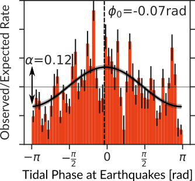

# seistides
Python package for the analysis of tidal modulation of seismicity.

Work-in-progress!

Check out the Jupyter notebook to reproduce the results from Beaucé et al.
(2023). The analysis routines are in `seistides/seistides.py`.

References
----------

- Beaucé, E., Poli, P., Waldhauser, F., Holtzman, B., & Scholz, C. (2023). Enhanced tidal sensitivity of seismicity before the 2019 magnitude 7.1 Ridgecrest, California earthquake. Geophysical Research Letters, 50(14), e2023GL104375.

